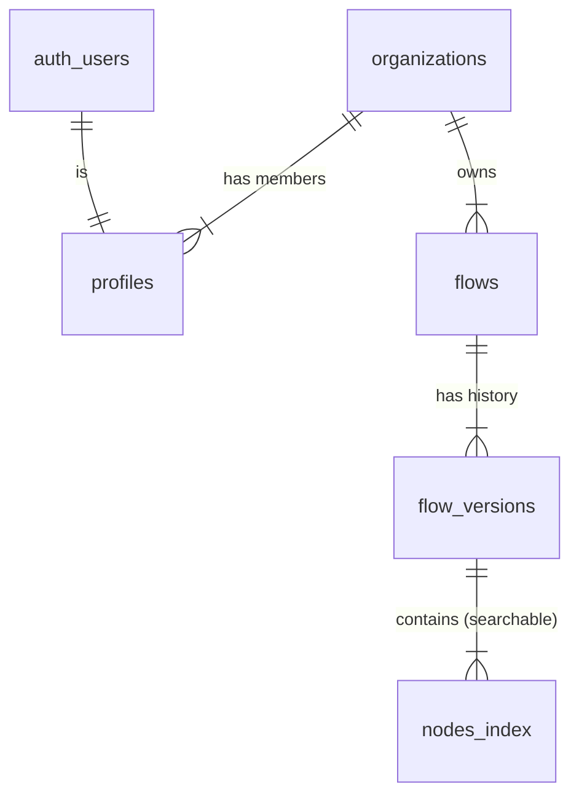

# Phase 1 Specification: Persistence & Collaboration

**Status**: DRAFT
**Target**: Q1 2026
**Goal**: Transition `signup-flow-maker` from a local-only prototype to a multi-user, authenticated cloud application using Supabase.

---

## 1. Architecture Overview

We will introduce a backend services layer (BaaS) using **Supabase** to provide:
1.  **PostgreSQL Database**: To store flows, versions, components, and organization data.
2.  **Authentication**: To handle user identity and secure access.
3.  **Realtime**: (Optional for Phase 1, but enabled by default) for presence/locking.

The frontend (Next.js) will communicate with Supabase using the `@supabase/supabase-js` client.

## 2. Database Schema (PostgreSQL)

We will use a relational model to organize data. Key entities include Organizations, Profiles, Flows, and Versions.

### 2.1 Entity Relationship Diagram (Conceptual)



### 2.2 Table Definitions

#### `organizations`
High-level container for team content.
- `id` (uuid, PK)
- `name` (text)
- `slug` (text, unique)
- `created_at` (timestamptz)

#### `profiles` (extends `auth.users`)
Public profile data for users.
- `id` (uuid, PK, refs `auth.users`)
- `organization_id` (uuid, refs `organizations.id`)
- `full_name` (text)
- `avatar_url` (text)
- `role` (enum: 'admin', 'editor', 'viewer')

#### `flows`
The existence of a "document" or "canvas".
- `id` (uuid, PK)
- `organization_id` (uuid, refs `organizations.id`)
- `name` (text)
- `description` (text)
- `is_locked` (boolean) - *For preventing edits during maintenance or if another user is editing (Phase 1.5)*
- `current_version_id` (uuid, refs `flow_versions.id`) - *Quick access to latest*
- `created_by` (uuid, refs `profiles.id`)
- `updated_at` (timestamptz)

#### `flow_versions`
Immutable snapshots of the flow state.
- `id` (uuid, PK)
- `flow_id` (uuid, refs `flows.id`)
- `version_name` (text, optional) - *e.g., "Pre-refactor", "v1.0"*
- `data` (jsonb) - *The complete snapshot of the flow. This includes:*
    *   *All Nodes & Edges (positions, ids, types)*
    *   *All Node "Copy" (Text content, labels, configured properties)*
    *   *All Variables (schema definitions & bindings like `→ rosteringMethod`)*
    *   *Viewport state (zoom, x/y position)*
    *   *This acts as a "save file" that guarantees 100% restoration.*
- `created_at` (timestamptz)
- `created_by` (uuid, refs `profiles.id`)

#### `nodes_index` (Table for Analytics/Search)
*Note: To satisfy the roadmap goal of relational node tables while maintaining performance, we will use this as a "derived" table. When a version is saved, a database trigger or application logic extracts key metadata here.*
- `id` (uuid, PK)
- `flow_version_id` (uuid, refs `flow_versions.id`)
- `node_id` (text) - *The ID used in the JSON graph*
- `type` (text) - *e.g., "screen", "decision"*
- `label` (text) - *For search*
- `component_id` (text, nullable) - *Refers to legacy component ID if applicable*

## 3. Authentication & Authorization

### 3.1 Strategies
- **Auth Provider**: Google OAuth (Primary) + Email/Password (Secondary).
- **Domain-Based Auto-Join**: To simplify collaboration, users with the same email domain (specifically `@teaching.com` for our internal team) will automatically join the same Organization.
    *   *First user of a domain*: Creates the Organization.
    *   *Subsequent users*: Automatically added to that Organization.
    *   *Public domains (gmail.com, etc)*: Treated as individual private workspaces.

### 3.2 Role-Based Access Control (RBAC)
We will use Row Level Security (RLS) policies to enforce roles.

| Role | Permissions |
| :--- | :--- |
| **Viewer** | `SELECT` on Flows, Versions. Cannot Edit. |
| **Editor** | `SELECT`, `INSERT` (Versions), `UPDATE` (Flow Metadata). |
| **Admin** | `DELETE` Flows, Manage Team Members. |

**Example RLS Policy (Pseudo-code):**
```sql
CREATE POLICY "Org members can see flows" ON flows
FOR SELECT USING (
  organization_id IN (
    SELECT organization_id FROM profiles 
    WHERE id = auth.uid()
  )
);
```

## 4. Workflows & Features

### 4.1 Saving Strategy ("Save Points")
To balance "Autosave" confidence with "Version" clarity:
1.  **Autosave (Drafts)**: The UI will auto-save to a `draft` state in a separate Redis cache OR a mutable column on the `flows` table (`draft_content` JSONB) every few seconds.
2.  **Explicit Save (Commit)**: When the user clicks "Save Version", we create a new row in `flow_versions`.
    *   *Prompt*: "Name this version (optional)"
3.  **Rollback**: The "Version History" side panel lists rows from `flow_versions`. Clicking "Restore" creates a *new* version with that data (forward-only history).

### 4.2 Initial Data Seeding
We must ensure the app is not empty when the team first logs in. We will seed the database with the current "Blueprints".

1.  **Target Organization**: The Organization created for `@teaching.com`.
2.  **Source Data**: The mappings defined in `src/data/blueprints.ts`.
    *   `educator-teacher`
    *   `individual-student`
    *   `individual-parent`
    *   `individual-adult`
    *   `educator-school-admin`
    *   `educator-district-admin`
3.  **Process**:
    *   A seeding script (or Admin API Action) will iterate through these keys.
    *   For each key, it will:
        1.  Hydrate the flow graph (Nodes + Edges) using the existing `FlowHydrator` logic.
        2.  Create a new row in `flows` (e.g., Name: "Educator - Teacher").
        3.  Save the hydrated JSON graph into `flow_versions` as "Initial Import".


## 5. Environment Hygiene

We will create two Supabase projects:
1.  **Production (`signup-flow-prod`)**: Stable, connected to main branch deployment.
2.  **Staging (`signup-flow-staging`)**: For testing new database migrations and risky features.

**Env Variables:**
- `.env.local` (Local Dev -> Connects to Staging or Local Docker instance)
- `.env.production` (Vercel Prod -> Connects to Production)
- `.env.preview` (Vercel Preview -> Connects to Staging)

## 6. Implementation Plan / Tasks

1.  **Setup Supabase**: Create Projects, init local dev environment.
2.  **Auth Integration**: Wrap root app `layout.tsx` in `SessionProvider`. Add Login screen.
3.  **Database Migration**: Write `.sql` files for tables defined in Section 2.
4.  **API Layer**: Create a `lib/supabase/client.ts` and Server Actions for reading/writing flows.
5.  **UI Updates**:
    *   Replace `useLocalStorage` hooks with React Query hooks wrapping Supabase calls.
    *   Add "Organization/Team" settings page.
    *   Add "History" panel to the Flow Editor.
6.  **Migration Tool**: Build the client-side importer.

